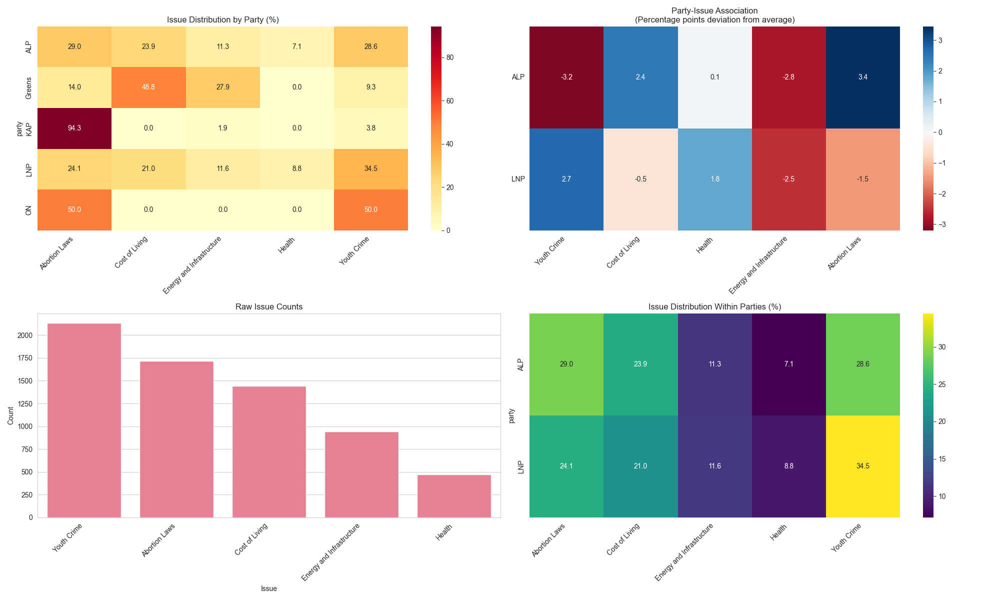

# Qualitative Data Analysis with AI

This is the code to support the ResBaz 2024 workship on Qualitative Data Analysis with AI by Mat Bettinson <mat.bettinson@qut.edu.au>.

This repo contains a freshly composed dataset of Australian Reddit data before and after the 2024 Queensland State Election. There is a [separate readme](2024_qld_election_reddit_dataset/dataset_readme.md) for that.

## Folders

- `2024_qld_election_reddit_dataset` - The dataset of Reddit data before and after the 2024 Queensland State Election.
- `experiments` - Prompts and AI coding run data for part 3 of the workshop. Of particular interest is `experiments\1\phase1\phase1_assembled.csv` which contains coding data for all ~25k comments.
- `outputs` - simple demonstration outputs from parts 1 and 2 of the workshop.
- `resbaz24` - A Python package containing code to process documents, and run AI models with strict JSON schema-defined responses.

## Notebook files

- `qda_01_making_prompts.ipynb` - A Jupyter notebook to illustrate the basics of importing data and assembling prompts using the `resbaz24` package.
- `qda_02_ai_responses.ipynb` - A Jupyter notebook illustrating calling AI models, and handling JSON responses

## Python files

In the final part of the workshop we 'rip the backaid off' and switch to Python files to illustrate the basics of running and organising a series of experiments, cf. the experiments folder.

- `qda_03_prompts.py` - Versioned prompts for our Queensland Election dataset analysis experiments.
- `qda_03_pipeline.py` - A class containing the main code to run an experiment.
- `qda_03_run.py` - A script to run the experiments, must be given a version number as an argument.
- `qda_03_analyse.py` - A script to analyse the results of the experiments and generate a text and visual report.
- `qda_04_sample_errors.py` - A script to select a sample of coding values, specifically party = LNP and issue = AL. We'd use the output of this drill into the unexpected results set out in the workshop.

## The results

First, beware. This is a workshop example, and cross-checking the AI coding and identifying errors is part of the workshop.

To see the results in context you should refer to:

1. `2024_qld_election_reddit_dataset/dataset_readme.md` which explains how we collected the source dataset of Reddit comments which were AI selected as being relevant for Qld politics.
2. Then look at `qda_03_prompts.py` to see the prompt instruction that was used. The coding is based on election issues of interest, and a party alignment where the AI was able to infer support for that party based on their comment.
3. You can cross check the prompts with the AI coding by looking at prompts and responses in `experiments/[version]/phase1/`
4. See the results of the experiment in `experiments/[version]/phase1/phase1_assembled.csv` which contains the AI coding for all ~25k comments.
5. See the [text report](analysis_report.txt) of qualitiative analysis of the results.
6. See an foundation model [AI summary](summary_report_claude_sonnet.txt) of the results.
7. And the visual chart of the results:

 

You should understand the workshop is intended to illustrate reproduceable iterative assessment of AI-based coding. There are two sets of raw data in the `experiments` folder, one for the initial run, and one for the revision with significant prompt changes. 

## Other iterations for version 2 of the experiment

- Significantly improved JSON output adherence - dropping properties when the AI is unable to code a comment (large reduction in output tokens)
- Substantial improvement in the v2 prompt, specifically around coding supposed party support of each comment
- Filtered the comments into those with 10 words or more. This dropped the dataset from 25k to 17k comments.
- Included the prompt to generate the AI text summary of the report data (includes context, prompting, qualitative results etc)

## Reproducing the Queensland Election AI coding experiment

All you need to do is get an API key from [Google AI Studio](Google) and put this in a `.env` file in the root of the project with a line like this:
```
GOOGLE_API_KEY="your api key here"
```
You'll want to set up a python virtual environment, activate it, install the deps with `pip install -r requirements.txt` and then you can run `python qda_03_run.py 1` to run the experiments. You should delete all the data in the `experiments` folder otherwise the script will return instantly with no work to do. You may need to re-run this if it errors out with JSON parsing errors and what have you, it will pick up where it left off.

When complete, generate the report with `python qda_03_analyse.py 2`.

## For more

The Digital Observatory is a Research Infrastructure unit at Queensland University of Technology. We are particularly active in developing data platforms for Australian social media analytics, and using generative AI to support qualitative data analysis.
We are able to support QUT researchers and PhD students, and are open to collaborations with other institutions. For more information and to contact us, please visit [https://www.digitalobservatory.net.au/](https://www.digitalobservatory.net.au/).
